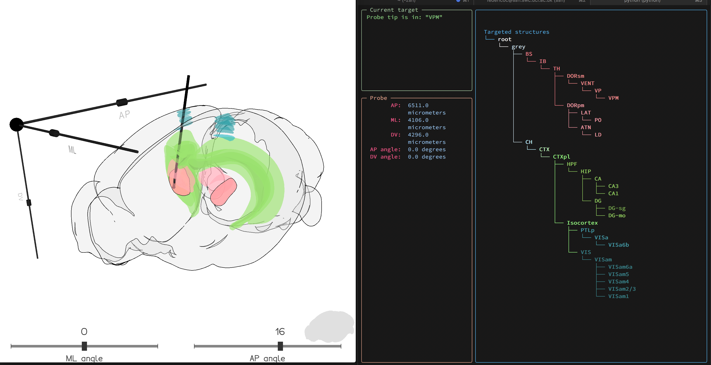

# Probe planner
A tool to help plan where to implant electrodes, plobes and fibers.

It visualizes the probe given the location of it's tip (in AP/ML/DV coordinates expressed micrometers) and it's angles (relative to the ML and AP plane, as you'd tilt a stereotax).
As the probe is moved around this application displays which brain regions the probe is going through.



## Installation
```
    pip install probeplanner
```

## Usage
The easiest way to use probepanner is through the command line interface. In your terminal use:
```
pplanner
```
to launch the application. You can get a help docstring:
```
(brainrender) ❯ pplanner --help
Usage: pplanner [OPTIONS]

Options:
  -aim-at, --at TEXT              Name of brain region to aim at
  -hemisphere, --h TEXT           target hemisphere
  -AP-angle, --AP INTEGER         angle on AP plane  [default: 0]
  -ML-angle, --ML INTEGER         angle on ML plane  [default: 0]
  -highlight, --hl TEXT           names of brain regions to highlight
                                  (separated by space)  [default: ]

  -debug, --debug                 Debug?  [default: False]
  --help                          Show this message and exit.
                                                                         
```

The main arguments are:
- **aim-at** which lets you aim at a brain region by passing its name (e.g. 'CUN' will set the tip of the probe in the cuneiform)
- **AP** and **ML** let you specify the angle of the probe on the two main planes
- **highlight** lets you pass a list of regions names (e.g. 'CUN MOs SCm') to be highlighted during use.